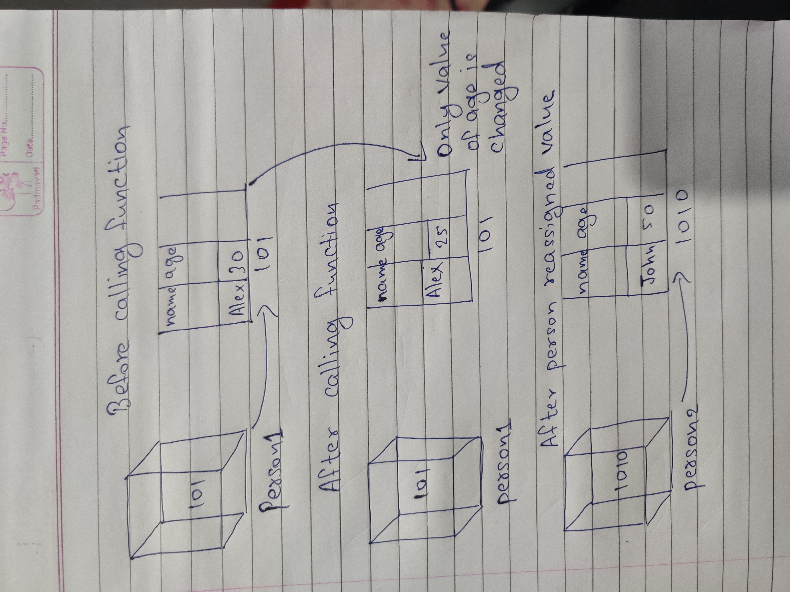

1. What will be the output and explain the reason.

```js
let obj = { name: 'Arya' };
obj = { surname: 'Stark' };
let newObj = { name: 'Arya' };
let user = obj;
let arr = ['Hi'];
let arr2 = arr;
```

Answer the following with reason after going through the above code:

- `[10] === [10]`// false Both have different addresss
- What is the value of obj? // answer
- `obj == newObj`// false Both have different address
- `obj === newObj`// false new obj in non primitive and  obj is primitive
- `user === newObj`// false new obj in non primitive and  user is primitive
- `user == newObj` false new obj in non primitive and  user is primitive data type
- `user == obj`True they don't have any value and both are primitive
- `arr == arr2`True they have the same address to access the value
- `arr === arr2` True they have the same address to access the value
  ,
2. What's will be the value of `person1` and `person2` ? Explain with reason. Draw the memory representation diagram.

<!-- To add this image here use  -->

```js
function personDetails(person) {
  person.age = 25;
  person = { name: 'John', age: 50 };
  return person;
}
var person1 = { name: 'Alex', age: 30 };h
var person2 = personDetails(person1);
console.log(person1);// {name: 'Alex', age: 25}
console.log(person2); // {name: 'John', age: 50}
```
Value of person1 before calling function is  name: 'Alex', age: 30
after calling function name: 'Alex', age: 25 Value of age is updated in the function so it is changed from 30 to 25 
value of person2 after calling the function is name: 'John', age: 50 because the person is reassigned values and the reassigned value is returned.
3. What will be the output of the below code:

```js
var brothers = ['Bran', 'John'];
var user = {
  name: 'Sansa',
};
user.brothers = brothers;
brothers.push('Robb');
console.log(user.brothers === brothers); //1.output //true
console.log(user.brothers.length === brothers.length); //2. output //true
```
